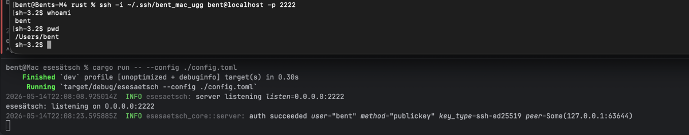

# esesätsch

[](https://github.com/BentBr/esesaetsch/actions/workflows/ci.yml)
[](https://github.com/BentBr/esesaetsch/actions/workflows/release-please.yml)
[](LICENSE)
[](rust-toolchain.toml)
[](.github/workflows/ci.yml)

A strict, cross-platform SSH server written in Rust.

`esesätsch` is a drop-in alternative to `sshd` for small-to-medium deployments where you want a tight modern crypto policy, central key/cert management, and an auditable codebase you can read end-to-end in an afternoon.



```sh
# Generate a host key, copy an example config, run.
cargo run --release -- gen-key --host-key ./host_key
cp examples/minimal.toml ./config.toml
cargo run --release -- serve --config ./config.toml --port 2222
# Then from another terminal:
ssh -p 2222 alice@127.0.0.1
```

---

## Features

- **Modern crypto only.** No CBC ciphers, no SHA-1 MACs, no legacy DH. The wire policy is compiled into the binary — there is no runtime knob to weaken it. Includes **ML-KEM/X25519 post-quantum hybrid KEX** (the same one OpenSSH 9.9+ negotiates by default) so today's traffic isn't decryptable by tomorrow's quantum-capable attacker.
- **Three auth methods, each independently toggleable**:
  - **Public key** against a central TOML allowlist
  - **OpenSSH certificate** against a CA trust set with full validation (signature, validity window, principals, revocation list, fail-closed unknown critical options)
  - **OS-native password** via PAM on Linux/macOS, `LogonUserW` on Windows
- **Real PTY support** so vim / htop / tmux work over an interactive session (uses `portable-pty`, which means Unix PTY on Linux/macOS and ConPTY on Windows).
- **Information-disclosure hygiene** built into every auth path: uniform reject shape, constant-time pubkey/CA compares, sentinel-work on the unknown-user path so timing or branch analysis can't enumerate accounts. Per-call-site filtering plus a stderr-wrapping redaction layer keep `password=…` fields and raw key bytes out of logs even at trace level.
- **Service installation** built in: `esesätsch install-service` writes a systemd unit / launchd plist (or prints the Windows `sc.exe` command) so the host OS supervises the binary.
- **Cross-platform.** CI builds + tests on Linux x86_64, Linux ARM64, macOS aarch64, Windows x86_64, and Windows ARM64.
- **Strict CI**: `fmt`, `clippy::all + pedantic + nursery` with **`-D warnings`**, tests on three OSes, release builds for five targets, **100% line coverage gate on the core library**. Conventional Commits enforced on every PR.
- **Fully automated releases.** [release-please](https://github.com/googleapis/release-please) opens a release PR on every `feat:`/`fix:` push to `main`, runs the full CI matrix against it, and on merge publishes a tagged GitHub Release with pre-built binaries for all 5 targets.

## Status

Pre-1.0 — the wire protocol is implemented and tested against the real `russh` client, but the package isn't on crates.io yet and the API surface may still shift between 0.x minor releases. See the [CHANGELOG](CHANGELOG.md) for what landed in each version.

## Quick start

1. Install Rust nightly (`rustup default nightly` — pinned via `rust-toolchain.toml`).
2. Install build-time deps (PAM bindings need `libclang`):
   - **macOS**: `brew install llvm`, then `export LIBCLANG_PATH=/opt/homebrew/opt/llvm/lib DYLD_FALLBACK_LIBRARY_PATH=/opt/homebrew/opt/llvm/lib`.
   - **Linux**: `sudo apt-get install -y libpam0g-dev libclang-dev`.
   - **Windows**: no extra prerequisites.
3. Build:
   ```sh
   cargo build --release
   ```
4. Generate a host key, write a config, and start the server:
   ```sh
   ./target/release/esesätsch gen-key --host-key ./host_key
   cp examples/minimal.toml ./config.toml
   # …add your public key to [auth.authorized_keys]…
   ./target/release/esesätsch serve --config ./config.toml
   ```

## Documentation

| Page | Contents |
|---|---|
| [User guide — Configuration](docs/user-guide/configuration.md) | Every TOML field with defaults, allowed values, and security notes |
| [User guide — CLI reference](docs/user-guide/cli-reference.md) | Every subcommand and flag with runnable examples |
| [Development guide](docs/development.md) | Build/test/release workflow, project layout, libclang setup per OS |
| [`examples/README.md`](examples/README.md) | Ready-to-edit example configs (minimal, pubkey-only, password, cert, full reference) |
| [`docs/index.md`](docs/index.md) | Documentation hub |

## Tech stack

- [`russh`](https://crates.io/crates/russh) 0.60+ — pure-Rust SSH protocol, ML-KEM PQ KEX, native `impl Future` traits
- [`portable-pty`](https://crates.io/crates/portable-pty) — cross-platform PTY/ConPTY
- [`nonstick`](https://crates.io/crates/nonstick) (Unix) — safe PAM bindings via `libpam-sys`
- [`windows`](https://crates.io/crates/windows) (Windows) — `LogonUserW` / `CreateProcessAsUserW`
- [`tokio`](https://crates.io/crates/tokio) — async runtime
- [`tracing`](https://crates.io/crates/tracing) — structured logging with stderr redaction
- [`ssh-key`](https://crates.io/crates/ssh-key) — host-key generation + OpenSSH cert parsing
- [`clap`](https://crates.io/crates/clap) — CLI

## Layout

```
crates/
├── esesätsch-core/       # library: protocol, auth, session, config (OS-agnostic, 100% coverage target)
└── esesätsch/            # binary: CLI + OS-specific impls (PAM, LogonUserW, portable-pty, service installer)
examples/                  # runnable example configs
docs/                      # user / development guides
.github/workflows/         # ci.yml + release-please.yml + release-assets.yml
```

## Contributing

PRs welcome. CI requires:

- **Conventional Commits**: `feat:`, `fix:`, `chore:`, `docs:`, etc.
- **Branch name**: `<type>/<lowercase-kebab>`, e.g. `feat/cert-auth-wiring`.
- **Strict clippy**: `cargo +nightly clippy --workspace --all-targets -- -D clippy::all -D warnings -D clippy::pedantic -D clippy::nursery`.
- **fmt**: `cargo fmt --all -- --check`.
- **All tests pass** on Linux x86_64, macOS aarch64, Windows x86_64.

See [`docs/development.md`](docs/development.md) for the full developer workflow.

## License

Licensed under the Apache License, Version 2.0. See [`LICENSE`](LICENSE) and [`NOTICE`](NOTICE).

Copyright © 2026 Bent Brüggemann.
